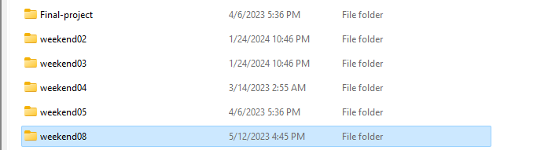

## This project includes all mini projects coded during the Encode Bootcamp

## Description

During this encode bootcamp , I have learn alot about Web3 technologies and how to interact with blockchain using ether.js , metamask sdk and frontend such as angular and nuxtjs as backend to faciliate the API routing.

We have also coded smart contracts using hardhat tool suite to ease the development and testing of smart contracts.

Below also attached some screenshots from the final project that we hacked through out the week. 
It was fun indeed to scratch our heads around the whole blockchain APIs.

For the final project,  we have an idea of a simple web3 wallet and also lock token smart contract.

## Final Project Screenshots

#### Price Feed ABI using uniswap contracts

#### Wallet Token Balance

#### Home Page

#### Time Lock Token contract functionality

#### Hardhat Test Scripts

## Installation

1. Clone the repository.
2. Install the dependencies using `npm install or pnpm install`.

## Usage

1. Run `ng serve` for a dev server. Navigate to `http://localhost:4200/`.
2. The application will automatically reload if you change any of the source files.

